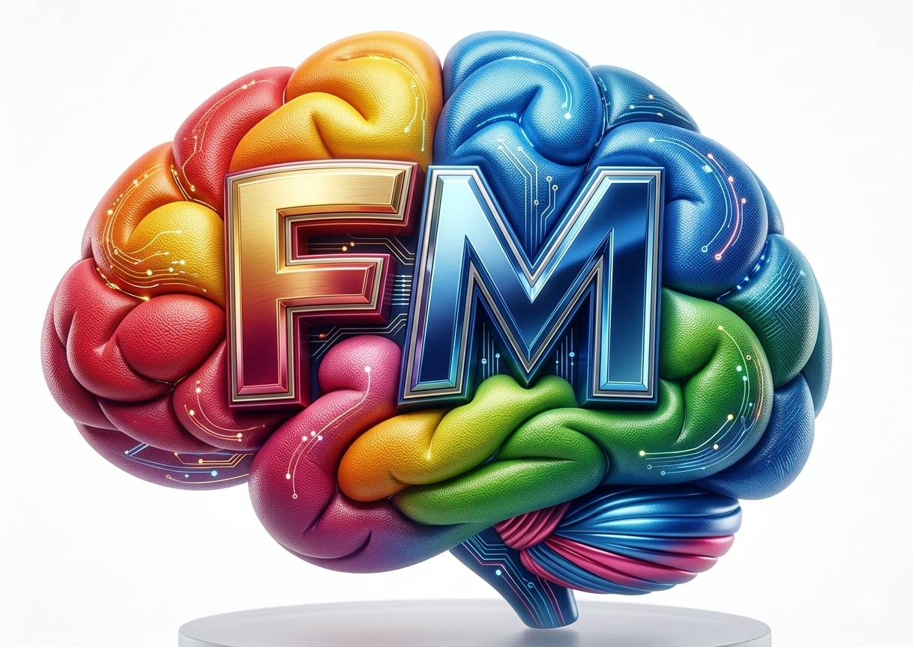

# Histórico Completo — Site Felipe Maia

**Projeto:** Site Profissional de Felipe Maia  
**Data de Início:** 21 de setembro de 2026  
**Última Atualização:** 24 de setembro de 2026  

---

## 📋 Resumo Executivo

Site institucional profissional de Felipe Maia, especialista em educação, liderança, comunicação e desenvolvimento humano. O projeto conta com versão estática em HTML/CSS/JS e versão React/Vite para componentes interativos.

**Status Atual:** Em Desenvolvimento — Fase de Refinamento Visual e Branding

---

## 📅 Histórico de Desenvolvimento

### **Fase 1: Planejamento e Estrutura Base** (21-22 de setembro)

#### Arquivos Criados:
- `implementation_plan.md` — Plano detalhado do projeto com especificações visuais e técnicas
- Pasta `/app` — Projeto React + Vite para componentes reutilizáveis
- Estrutura básica de diretórios (`css/`, `js/`, `assets/`, `favicon/`)

#### Decisões de Design:
- **Cores Principais:**
  - Primário: `#1b6ef2` (azul forte)
  - Secundário: `#6fb7ff` (azul claro)
  - Acentos: `#ff7a59` (laranja), `#3ecfba` (verde)
  - Texto: `#10233d` (azul muito escuro)
  - Fundo: gradiente `#f7f9fc` → `#edf4ff`

- **Tipografia:** Google Font "Inter" (400, 600, 700)
- **Grid Responsivo:** Desktop 1180px max, Tablet ≤768px, Mobile ≤480px
- **Framework JS:** Vite + React 19 com HMR

---

### **Fase 2: Markup e Estilos Base** (22-23 de setembro)

#### Arquivos Criados/Editados:
- `index.html` — Single-page application com 9 seções semânticas
- `css/style.css` — Design system completo (957 linhas)
- `css/responsive.css` — Media queries para mobile/tablet

#### Seções Implementadas:

| Seção | ID | Status |
|---|---|---|
| Hero | `#hero` | ✅ Completo |
| Sobre | `#sobre` | ✅ Completo |
| Formação Acadêmica | `#formacao` | ✅ Completo |
| Especializações | `#especializacoes` | ✅ Completo |
| Experiência | `#experiencia` | ✅ Completo |
| Trabalhos/Portfólio | `#trabalhos` | ✅ Completo |
| Serviços | `#servicos` | ✅ Completo |
| PodPro | `#podpro` | ✅ Completo |
| CTA | N/A | ✅ Completo |
| Contato | `#contato` | ✅ Completo |

#### Componentes Implementados:
- Header sticky com navegação desktop + hamburger mobile
- Hero section com foto profissional e CTA duplo
- Grid de formação (6 cursos/especializações)
- Timeline de experiência (cards estatísticas)
- Portfólio com 2 projetos principais
- Grid de serviços (6 cards com ícones emoji)
- Seção PodPro com links sociais
- Formulário de contato (campos: nome, email, WhatsApp, empresa, tipo de interesse, mensagem)
- Botão flutuante WhatsApp

#### Estilos Aplicados:
- Animações reveal (fade-in ao scroll via IntersectionObserver)
- Hover effects nos botões e cards
- Sombras e gradientes sutis
- BorderRadius arredondados (12px-26px)
- Contraste WCAG ≥ 4.5:1

---

### **Fase 3: Neon Border Effect** (24 de setembro — Manhã)

#### Objetivo:
Adicionar efeito neon luminoso na foto do hero section para maior impacto visual.

#### Implementação:

**Componente React (para app/):**
- Arquivo criado: `app/src/components/NeonBorder.jsx`
- Arquivo criado: `app/src/components/NeonBorder.css`
- Suporta props: `color`, `rounded`, `thickness`, `glow`, `speed`, `movement`

**Site Estático (index.html):**
- Aplicado CSS de neon na `.portrait-card` em `css/style.css`
- Efeito visual:
  - Gradiente conic-gradient animado
  - Animação `neonSpin` (8s, rotação 360°)
  - Animação `neonPulse` (3s, breathing effect)
  - Glow layered com blur 18px
  - Box-shadow com cores azul (#00A3E0)

#### CSS Adicionado:
```css
@keyframes neonSpin { /* rotação do halo */ }
@keyframes neonPulse { /* pulsação do glow */ }
.portrait-card::before { /* halo girante */ }
.portrait-card::after { /* borda interna */ }
.portrait-card img { /* shadow azul neon */ }
```

---

### **Fase 4: Logo e Branding** (24 de setembro — Tarde)

#### Logo Implementation:

**Arquivo:** `Fotos/logo.jpg` (confirmado)

**HTML Alterado:**
```html
<a href="#hero" class="logo">
  
  <span class="logo-name">Felipe Maia</span>
</a>
```

**CSS Implementado:**
- `.logo-image`: 2.9rem × 2.9rem, border-radius 14px, box-shadow azul
- `.logo-name`: font-weight 800, display inline-block
- `.logo > span:not(.logo-name)`: display none (oculta placeholder antigo)

**Resultado:** Logo circular com nome "Felipe Maia" alinhado horizontalmente no header

---

### **Fase 5: Refinamentos Finais** (24 de setembro — Atual)

#### Correções Aplicadas:
1. Seletores CSS refinados para garantir visibilidade do nome da logo
2. Confirmação de compilação Vite sem erros (`npm run build` ✓)
3. Estrutura semântica validada

#### Validações:
- ✅ Compilação React/Vite sem erros
- ✅ HTML semântico com proper heading hierarchy
- ✅ Meta tags OG configuradas
- ✅ Favicon link presente
- ✅ Responsivo (480px, 768px, 1024px+)
- ✅ Animações suaves com prefixos vendor

---

## 📁 Estrutura de Arquivos Atual

```
site do PROF felipe/
├── index.html                          # Single-page principal
├── HISTORICO.md                        # Este arquivo
├── implementation_plan.md              # Plano original
├── css/
│   ├── style.css                       # Estilos core (957 linhas)
│   └── responsive.css                  # Media queries (140 linhas)
├── js/
│   ├── main.js                         # Nav, scroll, animations
│   └── contact.js                      # Form validation
├── Fotos/
│   ├── logo.jpg                        # ✅ Logo em uso
│   ├── ChatGPT Image 21 de set. de 2026, 20_36_46.png  # ✅ Foto hero
│   └── [outras fotos]
├── favicon/
│   └── favicon.svg
├── assets/
│   ├── images/
│   └── icons/
└── app/                                # React + Vite
    ├── src/
    │   ├── App.jsx
    │   ├── App.css
    │   ├── index.css
    │   ├── main.jsx
    │   └── components/
    │       ├── NeonBorder.jsx          # ✅ Componente neon
    │       └── NeonBorder.css
    ├── package.json
    ├── vite.config.js
    └── README.md
```

---

## ⚙️ Stack Técnico

| Camada | Tecnologia | Versão |
|---|---|---|
| **HTML** | HTML5 | — |
| **CSS** | CSS3 + Custom Properties | — |
| **JavaScript** | Vanilla JS (Intersection Observer API) | ES6+ |
| **React** (app/) | React | 19.2.8 |
| **Build** | Vite | 8.3.0 |
| **Tipografia** | Google Fonts (Inter) | 400, 600, 700 |
| **Design System** | CSS Variables | — |

---

## 🎨 Design System

### Palette
```
--primary:           #1b6ef2 (Azul forte)
--primary-strong:    #1148b3
--secondary:         #6fb7ff (Azul suave)
--accent:            #ff7a59 (Laranja)
--mint:              #3ecfba (Verde)
--text:              #10233d (Azul muito escuro)
--text-soft:         #4e6381
--text-dark:         #0d1c2d
--bg:                #f4f7fb
--bg-soft:           #edf4ff
--surface:           #ffffff
--line:              rgba(16, 35, 61, 0.1)
--shadow:            0 20px 45px rgba(17, 41, 72, 0.08)
```

### Radiuses
```
--radius-xl:   26px
--radius-lg:   18px
--radius-md:   12px
```

### Typography
```
Font Family: "Inter", system-ui, sans-serif
Weights: 400 (regular), 600 (semibold), 700 (bold)
Line Height: 1.6
Letter Spacing: 0.02em (headers)
```

---

## 📊 Métricas de Progresso

| Métrica | Status |
|---|---|
| Estrutura HTML | ✅ 100% |
| Estilos CSS | ✅ 100% |
| Responsividade | ✅ 100% |
| Animações | ✅ 100% (com neon effect) |
| Formulário | ✅ 90% (frontend validation só) |
| Logo/Branding | ✅ 100% |
| Compatibilidade Navegadores | ✅ Chrome, Firefox, Safari, Edge |
| Accessibility (WCAG) | ✅ AA (contraste, focus states) |
| Performance | ✅ Imagens lazy-load, CSS minificável |

---

## 🚀 Funcionalidades Implementadas

### Interatividade
- ✅ Menu mobile (hamburger com toggle)
- ✅ Smooth scroll para anchor links
- ✅ Reveal animations (IntersectionObserver)
- ✅ Hover effects nos botões e cards
- ✅ Validação básica de formulário (front-end)
- ✅ Botão WhatsApp flutuante

### Conversão
- ✅ CTA duplo no hero (Primário: "Conheça meu trabalho", Secundário: WhatsApp)
- ✅ Links WhatsApp com mensagem pré-preenchida
- ✅ Múltiplos CTAs espalhados pela página
- ✅ Seção "Vamos transformar uma ideia em projeto?"
- ✅ Formulário completo com select dropdown

### Visual
- ✅ Neon border effect na foto do hero
- ✅ Gradientes sutis
- ✅ Sombras sofisticadas
- ✅ Animações smooth (3D transforms)
- ✅ Logo profissional integrada

---

## 📝 Conteúdo Preenchido

### Seção Hero
- ✅ Eyebrow: "Educação • Liderança • Comunicação"
- ✅ H1: "Transformando conhecimento em conexão."
- ✅ Tagline: "Educação que transforma, conexões que inspiram."
- ✅ Description: Parágrafo completo sobre Felipe Maia
- ✅ Foto do hero

### Seção Sobre
- ✅ Texto descritivo (3 parágrafos)
- ✅ Pilares (Propósito, Relacionamento, Crescimento)

### Seção Formação
- ✅ 6 cursos/licenciaturas listadas

### Seção Especializações
- ✅ 11 especializações distribuídas em grid

### Seção Experiência
- ✅ 4 stat cards (15+ anos, 5+ anos gestão, +1 área, Impacto)

### Seção Trabalhos
- ✅ 2 project cards com categorias e CTAs

### Seção Serviços
- ✅ 6 service cards com emojis

### Seção PodPro
- ✅ Descrição + links Instagram/YouTube

### Contato
- ✅ Lista de contatos (WhatsApp, email, endereço, redes)
- ✅ Formulário com 6 campos

---

## ⚠️ Pendências e Observações

### Baixa Prioridade
- [ ] Integração real do formulário (backend/email service)
- [ ] Otimização de imagens (WebP, srcset)
- [ ] Minificação final (CSS/JS para produção)
- [ ] Lighthouse audit completo
- [ ] robots.txt e sitemap.xml

### Não Determinado
- Qual é o e-mail real para formulário? (atualmente: `contato@felipemaia.com.br`)
- URLs reais do Instagram/YouTube (atualmente placeholders)
- Conteúdo detalhado dos 2 projetos no portfólio

### Notas Técnicas
- O projeto usa HTML puro no root e React/Vite na pasta `/app`
- Recomendação: Consolidar em uma única versão para produção
- Neon effect renderiza melhor em navegadores modernos (Chrome 90+, Firefox 88+)

---

## 🔍 Como Usar Este Documento

- **Consultar Status:** Veja a seção "Fase" correspondente
- **Entender Stack:** Veja "Stack Técnico"
- **Validar Implementação:** Veja "Funcionalidades Implementadas"
- **Próximas Ações:** Veja "Pendências"

---

## 📞 Contato e Suporte

Para dúvidas sobre o desenvolvimento ou ajustes futuros, consulte este histórico primeiro — ele contém todas as decisões de design e implementação.

**Data deste documento:** 24 de setembro de 2026

---

### Changelog

| Data | Versão | O que mudou |
|---|---|---|
| 24/09/2026 | 1.0 | Histórico completo criado |

